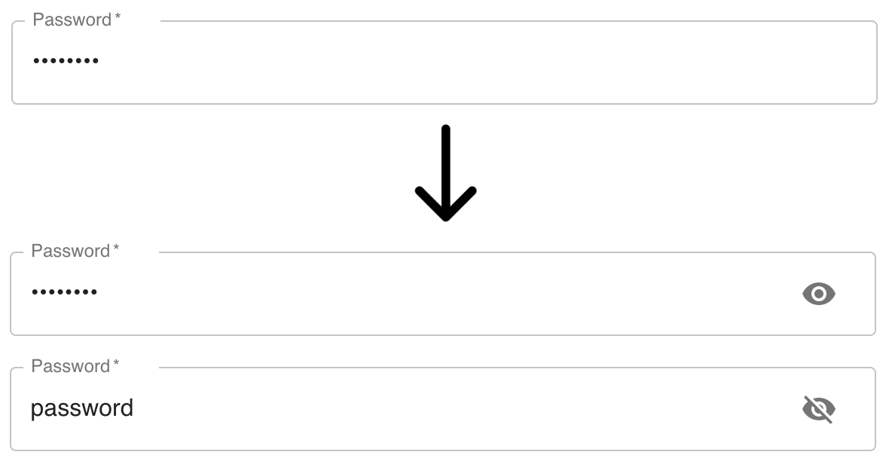

# material-ui-password

A **minimal, typescript-ready**, wrapper around the `TextField` component to add a "show password" option. 



# Installation

`npm i --save material-ui-password`

# Usage

```tsx
import { PasswordField } from "material-ui-password";

<PasswordField ... />

```

Use as any normal `TextField`, it justs add a visibility toggle. By default the password is hidden.

It won't mess with your styles, and you can use any TextField property including InputProps.

# License

MIT